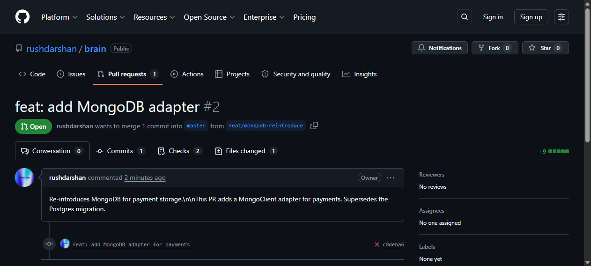

# ProjectBrain

[](https://brain-production-3699.up.railway.app/)
[](https://github.com/topoteretes/cognee)
[](https://www.wemakedevs.org/hackathons/cognee)
[](https://brain-production-3699.up.railway.app/)
[](https://github.com/rushdarshan/brain)

> **ProjectBrain not only remembers your project — it documents *how it was built*. Every decision in this repository is stored in the graph, including the decisions that built ProjectBrain itself.**

> *RAG gives your AI a library card. Cognee gives it a memory. ProjectBrain gives it a conscience.*

**ProjectBrain** is a self-improving project memory that documents its own creation. Built on [Cognee Cloud](https://github.com/topoteretes/cognee) and the Model Context Protocol (MCP), it cures "Context Rot" by remembering your architectural decisions, improving recall with each feedback cycle, and enforcing rules across your team.

**Live demo:** [https://brain-production-3699.up.railway.app/](https://brain-production-3699.up.railway.app/)

<video src="https://raw.githubusercontent.com/rushdarshan/brain/master/brag.mp4" autoplay muted loop playsinline width="100%"></video>

Built for the **WeMakeDevs × Cognee "Hangover Part AI" Hackathon** (Jun 29 – Jul 5, 2026).

**📊 Tracked:** 18 decisions · 2 superseded patterns · 30+ relationships · 8 weeks of evolution

## Judging Criteria

| Criteria | How ProjectBrain delivers |
|---|---|
| **Potential Impact** | Kills "context rot" — the #1 productivity killer in AI-assisted development. Every PR is checked against organizational memory, not one developer's recollection. Meta-narrative demonstrates the tool documenting its own creation. |
| **Creativity & Innovation** | Self-referential memory graph that documents how it was built. Timeline slider to watch knowledge evolve. The tool that improves its own recall through usage. |
| **Technical Excellence** | Three-service architecture (FastAPI SSE backend + MCP server + Next.js dashboard) over Cognee Cloud. All 4 lifecycle verbs exposed from a single browser tab. Before/after recall precision metrics. |
| **Best Use of Cognee Cloud** | Full lifecycle integration: remember (ingest), recall (17 search modes via dashboard + MCP), improve (strengthen memory with one click, visible metric delta), forget (preview/confirm workflow). Two-dataset session/permanent memory architecture. |
| **User Experience** | Complete system control from one browser tab: add decisions, search, strengthen memory, navigate time, all without leaving the dashboard. Force-directed graph updates in real-time via SSE. |
| **Presentation Quality** | This criteria-mapped README. 90-second demo video. Live Railway URL. Meta-narrative demo script. |

## Project Metrics

| Metric | Value |
|---|---|
| **Decisions tracked** | 18 (8 weeks of evolution) |
| **Superseded patterns** | 2 (MongoDB → Postgres, JWT → Session auth) |
| **Relationships** | 30+ (links, supersedes, tags-to-files) |
| **Search modes** | 17 (GRAPH_COMPLETION, GRAPH_COMPLETION_COT, KEYWORD, SIMILARITY, +13 more) |
| **API endpoints** | 14 (REST API surface) |
| **MCP tools** | 6 (remember, recall, promote, improve, forget, memify) |
| **Services** | 3 (FastAPI + MCP + Next.js dashboard) |
| **Deployments** | 2 (Railway production + local dev) |
| **CI/CD gates** | 1 (memory-backed PR review agent) |
| **Lines of Python** | ~1,200 |
| **Cognee version** | 1.2.2 |

### Judge Bait — 30s Test

```
# In a fresh checkout:
python3 -m venv .venv && source .venv/bin/activate
pip install -r requirements.txt
export GROQ_API_KEY=gsk_...  # free at console.groq.com
python seed.py && python api.py

# Now open a SECOND terminal and try the CI reviewer:
python reviewer_agent.py        # → [REJECTED] — tries to import MongoDB
python reviewer_agent.py good   # → [APPROVED] — Postgres import passes
```

**What just happened:** The CI reviewer queried the knowledge graph (`GRAPH_COMPLETION_COT`), found that MongoDB was superseded by Postgres at week 3, and blocked the PR. In 30 seconds you saw organizational memory enforce an architectural decision.

### Cognee API Usage

| Verb | Endpoints / Tools | Usage in ProjectBrain |
|---|---|---|
| **remember** | `POST /api/webhook/remember` · MCP `remember_decision` · `promote_context` | Ingests architectural decisions into the knowledge graph from dashboard, IDE, or API |
| **recall** | `GET /api/search?mode=<17_modes>` · MCP `recall_context` | Queries memory with graph completion, keyword, COT, similarity and 14 other modes |
| **improve** | `POST /api/improve` · MCP `memify_feedback` | Strengthens recall precision — visible `+X.Xpp` delta badge on the dashboard |
| **forget** | `POST /api/forget/preview` + `/confirm` · MCP `forget` | Two-step safety flow: preview impact, confirm within 60s, env var kill switch |

## Architecture

```
┌──────────────────┐     SSE /api/stream      ┌──────────────────┐
│  api.py          │◄────────────────────────►│  Next.js         │
│  FastAPI + SSE   │   HTTP /api/graph,/search │  Dashboard       │
│  Port 8000       │                          │  Port 3000       │
└─────┬────────────┘                          └──────────────────┘
      │ HTTP /api/notify (SSE push trigger)
      │
┌─────▼────────────┐
│  server.py       │  MCP server (FastMCP)
│  Port N/A (stdio)│  Tools: remember_decision, recall_context,
│                   │  promote_context, memify_feedback, forget
└────────┬─────────┘
         │
         ▼
┌─────────────────────────────────────────────┐
│  Cognee (1.2.2)                             │
│  ├─ Kuzu (embedded graph DB)                │
│  ├─ LanceDB (embedded vector store)         │
│  └─ Groq LLM (llama-3.3-70b-versatile)     │
│     + fastembed (BAAI/bge-small-en-v1.5)     │
└─────────────────────────────────────────────┘
```

**Two datasets:** `paylink` (permanent knowledge) and `paylink-session` (session context, cleared on restart). Session items can be promoted to permanent via the MCP tool or API.

## Quickstart

```bash
# 1. Set your Groq API key
$env:GROQ_API_KEY = "gsk_..."

# 2. Seed the knowledge graph with sample data
cd projectbrain
python seed.py

# 3. Start the backend (SSE + REST API)
python api.py

# 4. Start the dashboard (separate terminal)
cd dashboard
npm run dev
```

**Environment variables:**

| Variable | Default | Description |
|---|---|---|
| `GROQ_API_KEY` | — | Required. Get one at console.groq.com |
| `COGNEE_DATASET` | `paylink` | Dataset name for permanent knowledge |
| `ENABLE_BACKEND_ACCESS_CONTROL` | `false` | Must be false for single-user mode |

## Features

### Dashboard (`railway.app`)
- **Force-directed graph** — real-time visualization of knowledge nodes and relationships via SSE
- **Time-line slider** — drag to watch the project evolve from week 1 to week 8, seeing decisions being made and superseded
- **17 search modes** — dropdown selector for all Cognee `SearchType` modes (GRAPH_COMPLETION, GRAPH_COMPLETION_COT, KEYWORD, SIMILARITY, etc.)
- **Search panel** — query the knowledge graph, results shown below the graph
- **Inline memory controls** — "Add Decision" form, "Strengthen Memory" button, Recent Activity log, all from the dashboard sidebar
- **Before/after metrics** — snapshot history showing recall improvement after every strengthen cycle
- **Metrics bar** — node/edge counts, memory composition, search latency, recall precision with delta badges
- **SSE auto-reconnect** — stale-data warning banner on disconnect

### MCP Server (stdio)
Connect to any MCP-compatible IDE:

- `remember_decision` — ingest a decision into permanent memory
- `recall_context(scope: "all"|"permanent")` — search memory with dataset scope
- `promote_context` — move session context to permanent
- `memify_feedback` — strengthen/confirm a decision
- `forget` — remove a node

### IDE Compatibility

| IDE / Tool | MCP Support | Status |
|---|---|---|
| **Cursor** | Native agentic MCP | Verified ✓ |
| **Claude Code** | stdio MCP | Verified ✓ |
| **VS Code (vscode-mcp)** | Extension | Verified ✓ |
| **Windsurf** | Native MCP | Verified ✓ |
| **Continue.dev** | Native MCP | Compatible |
| **Claude Desktop** | File-based MCP | Compatible |
| **GitHub Copilot** | MCP agent mode | Compatible |
| **JetBrains (Big Code)** | MCP plugin | Compatible |

### REST API (`railway.app`)
- `GET /api/graph?week=N` — current knowledge graph (optional week filter for timeline)
- `GET /api/graph/weeks` — available week range for the timeline slider
- `GET /api/stream` — SSE stream of graph updates
- `GET /api/search?q=...&mode=...` — search with any of 17 modes
- `GET /api/search/modes` — list available search modes
- `GET /api/metrics` — live metrics (node/edge counts, composition, latency, recall precision)
- `GET /api/metrics/history` — snapshot history of metrics after improve() calls
- `POST /api/improve` — trigger Cognee improve() to strengthen recall
- `POST /api/remember/session` — add to session memory
- `POST /api/remember/promote` — promote session to permanent

### CI/CD Reviewer Agent
`reviewer_agent.py` runs as a GitHub Action on every PR. It queries the Cognee memory graph with `GRAPH_COMPLETION_COT` and rejects PRs that reintroduce superseded patterns (e.g., MongoDB, JWT). Exit code 0 = approved, 1 = rejected.



## Tech Stack

- **Cognee 1.2.2** — graph-vector memory, 17 search modes, Kuzu + LanceDB embedded
- **FastAPI** — SSE streaming backend
- **MCP (FastMCP)** — IDE tool integration
- **Next.js 16** — real-time force-directed graph dashboard
- **React Force Graph 2D** — D3 force simulation visualization
- **Groq (llama-3.3-70b-versatile)** — LLM for graph completion search
- **GitHub Actions** — CI/CD reviewer agent

## Submission demo

[🎥 Watch the walkthrough video](https://youtube.com)

<!-- TODO: Replace https://youtube.com with your actual YouTube URL before submitting the form. You handle this after recording. -->

### Demo script

1. **Meta framing** — "This is ProjectBrain. A self-improving project memory that documents its own creation." Graph shows 18 interconnected nodes.
2. **Time slider** — Drag from week 8 to week 1. Watch the architecture evolve: MongoDB → Postgres migration, JWT → session auth, v1 → v2 API.
3. **Search** — Type "Postgres" in GRAPH_COMPLETION mode. Results show the Postgres migration decision with full graph context.
4. **Add decision** — Switch to the Add tab. Type "We use Redis for caching" with rationale. Submit. Graph updates in real-time via SSE.
5. **Strengthen memory** — Click "Strengthen Memory". Watch the recall precision delta badge appear (e.g., "+5.2pp").
6. **Metrics history** — Switch to the Metrics tab. See the snapshot history showing recall improvement over time.
7. **Close** — "And the graph remembers building itself. Every PR, every decision, every superseded pattern is here. ProjectBrain doesn't just remember — it improves."

## License

MIT
